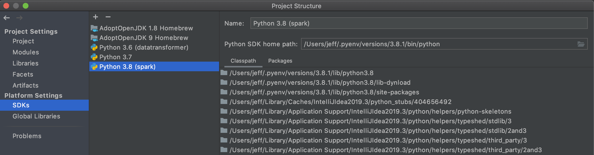
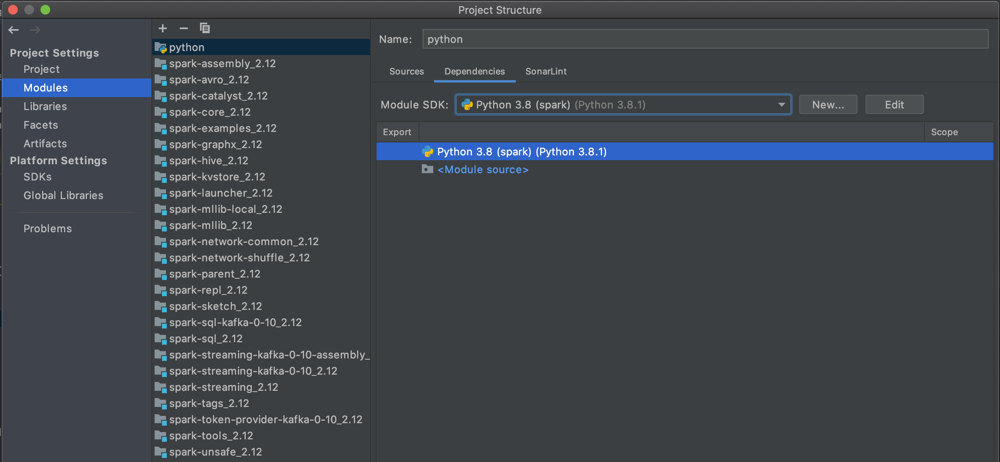
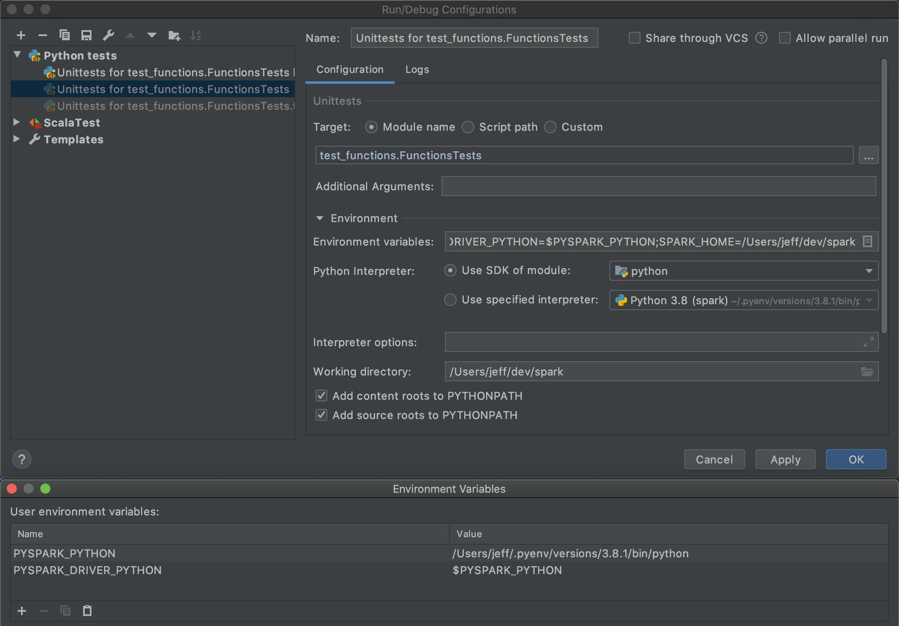

# Spark Development Tips

## PySpark setup in IDEA

First, follow the [documented setup instructions](http://spark.apache.org/developer-tools.html) for IntelliJ IDEA.

Next, ensure you have a valid Python version installed on your machine, and set up an SDK pointing to it.  One that 
is managed by `pyenv` will work fine.

Next, add the `python` directory as a module, using _File/New/Module from Existing Sources..._. Next, in the settings
for the new module, associate it with the Python SDK just created above.

Now, do a full project build to ensure there are no errors.

### Debugging PySpark tests

With all of the above done, you should be able to debug the tests under `python/pyspark/tests`, after a few environment
variables are set up.  The easiest way to do this is to create a new debug configuration for one of the Python tests
(which will probably fail initially), then edit it.  You will need to set the following:

* Working directory: `/path/to/source/spark`
* Environment variables:
  * `PYSPARK_PYTHON` = `/path/to/your/python` (the same one the SDK points to)
  * `PYSPARK_DRIVER_VERSION` = `$PYSPARK_PYTHON`
  

At this point, you should be able to re-run the debug configuration and hit breakpoints.